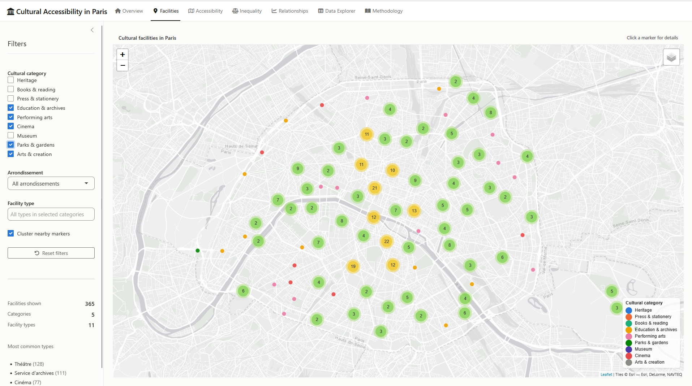

# Mapping Cultural Accessibility in Paris

A geospatial data-analysis project exploring how access to cultural facilities varies across Paris and whether these differences are associated with local socioeconomic conditions.

**Figure: Cultural facilities in Paris — interactive Facilities map**



*This screenshot is from the project's interactive **Shiny** app. It shows all 3,752 cultural facilities, grouped into clusters and coloured by category. The sidebar filters by category, arrondissement and facility type. Other tabs map accessibility on the 200 m grid, compare poverty groups, plot socioeconomic relationships and let you browse the data. See [Interactive app](#interactive-app) for how to run it.*

The project combines cultural-facility data from the French Ministry of Culture with the **INSEE Filosofi 200 m population grid** and uses **R** for data cleaning, geospatial analysis, statistics and visualization.

## Key findings

- The analysis includes **3,752 cultural facilities** and **2,164 populated 200 m grid cells**, representing approximately **2.05 million residents**.
- The population-weighted mean distance to the nearest cultural facility is approximately **128 m**.
- Overall cultural accessibility does **not** follow a simple socioeconomic gradient. The middle poverty group has the shortest mean distance to a cultural facility (\~107 m), while both the lowest-poverty (\~158 m) and highest-poverty (\~154 m) groups have longer distances.
- Results vary substantially by cultural category.
- The highest-poverty areas have comparatively long mean distances to **museums (\~1.04 km)** and **heritage locations (\~310 m)**.
- Other categories show different patterns. For example, performing-arts facilities are, on average, closer to residents of the highest-poverty grid cells than to those of the lowest-poverty cells.
- Mean living standard and distance to the nearest cinema have only a **very weak negative correlation (r ≈ -0.077)**.
- A simple model using poverty, an approximate social-housing indicator and local population explains only about **5.4%** of variation in cinema distance.

These results suggest that cultural inequality in Paris cannot be summarized by a single "access to culture" measure: spatial patterns differ considerably between museums, cinemas, books, performing arts, heritage and other categories.

## Research questions

1.  How are cultural facilities distributed across Paris?
2.  How far are residents from the nearest cultural facility?
3.  How does accessibility differ between cultural categories?
4.  Is cultural accessibility associated with local socioeconomic conditions?

## Methodology

Cultural facilities are cleaned, geocoded and grouped into broader analytical categories.

The INSEE Filosofi 200 m population grid provides fine-scale population and socioeconomic information.

For every populated grid cell, accessibility is measured using:

- distance to the nearest cultural facility;
- number of facilities within 500 m;
- number of facilities within 1 km;
- category-specific nearest-facility distances.

Accessibility statistics are population-weighted when comparing socioeconomic groups.

The statistical analysis includes descriptive comparisons, Pearson correlation and exploratory linear regression.

## Cultural categories

The analysis distinguishes between:

- Heritage
- Books & reading
- Performing arts
- Cinema
- Museum
- Parks & gardens
- Arts & creation
- Education & archives
- Press & stationery

## Example output


The full analysis, maps, statistical results and methodological limitations are available in the [**Quarto report**](reports/report.html).

## Interactive app

An interactive **Shiny** app sits on top of the pipeline outputs. It does not recompute any distances. It loads the processed datasets and lets you explore them through maps, charts and tables.

Run the pipeline first (see [Reproducibility](#reproducibility)), then launch the app from the project root:

``` r
shiny::runApp("app")
```

| Tab | What it shows |
|-----|---------------|
| **Overview** | Headline figures, research questions and distance / supply by category |
| **Facilities** | Clustered map of cultural facilities, filtered by category, arrondissement and facility type |
| **Accessibility** | Map of the 200 m grid shaded by distance to the nearest facility, or by the number of facilities within 1 km / 500 m, for any category, with a histogram of the values |
| **Inequality** | Population-weighted comparison across poverty quintiles, cell distributions, and a table comparing all categories |
| **Relationships** | Exploratory scatterplots of socioeconomic indicators against accessibility, with Pearson r, p-value and R² |
| **Data Explorer** | Searchable, filterable tables of both datasets with CSV export |
| **Methodology** | Data sources, processing steps and limitations |

The app requires `shiny`, `bslib`, `leaflet`, `plotly`, `DT`, `tidyverse`, `sf`, `here` and `scales`. Basemap tiles (Esri World Light Gray, OpenStreetMap) need an internet connection.

## Repository structure

``` text
paris-cultural-access/
├── R/
│   ├── 01_explore_cultural_data.R
│   ├── 02_clean_cultural_data.R
│   ├── 03_prepare_geography.R
│   ├── 04_prepare_population.R
│   ├── 05_calculate_accessibility.R
│   ├── 06_category_accessibility.R
│   ├── 07_inequality_analysis.R
│   └── run_all.R
│
├── app/
│   ├── app.R
│   ├── R/            # data loading and shared helpers
│   ├── modules/      # one Shiny module per tab
│   └── www/          # stylesheet
│
├── data/
│   ├── raw/
│   └── processed/
│
├── output/
│   ├── figures/
│   └── tables/
│
├── reports/
│   ├── report.qmd
│   └── report.html
│
└── README.md
```

## Reproducibility

The analysis is organized as a sequence of R scripts:

1.  explore the cultural dataset;
2.  clean and classify cultural facilities;
3.  prepare geographic data;
4.  prepare the INSEE population grid;
5.  calculate general cultural accessibility;
6.  calculate category-specific accessibility;
7.  analyze socioeconomic inequalities.

Large raw and processed datasets are not stored in the repository.

To run all the scripts in order, run:

``` r
source("R/run_all.R")
```

The final Quarto report can be rendered after the processing scripts have been run:

``` bash
quarto render reports/report.qmd
```

The interactive app can then be launched with `shiny::runApp("app")`.

## Required input files

Place the following source files in `data/raw/` before running the pipeline:

``` text
data/raw/
├── cultural_facilities.csv
├── carreaux_200m_met.gpkg
└── arrondissements_fixed.geojson
```

## Tools

- **R**
- **tidyverse**
- **sf**
- **ggplot2**
- **Quarto**
- **Shiny**, **bslib**, **leaflet**, **plotly**, **DT** (interactive app)
- geospatial data processing
- statistical analysis and visualization

## Workflow

``` text
Basilic cultural data
        ↓
cleaning and categorization
        ↓
geocoded cultural facilities
        ↓
                           
INSEE Filosofi 200 m grid -→ spatial accessibility metrics
                           
        ↓
population-weighted socioeconomic comparisons
        ↓
maps, tables and statistical analysis
        ↓
Quarto report + interactive Shiny app
```

## Data sources

This project uses publicly available datasets:

- French Ministry of Culture — Basilic cultural facilities database
- INSEE — Filosofi 2021, 200 m population and socioeconomic grid
- Paris administrative boundary data

Large source datasets are not committed to the repository.

## Limitations

Accessibility is based on straight-line distance rather than walking or public-transport travel time.

The analysis measures spatial proximity to cultural infrastructure, not actual cultural participation. It does not account for admission prices, opening hours, capacity or individual preferences.

Socioeconomic indicators are area-level measures, and the statistical analysis does not currently model spatial autocorrelation.

Facilities outside the administrative boundary of Paris are also excluded, which may underestimate accessibility for residents near the city boundary.

## Possible extensions

Future versions could include:

- walking-network accessibility;
- facilities in neighbouring communes;
- public versus commercial cultural facilities;
- population-weighted socioeconomic quantiles;
- spatial autocorrelation analysis;
- spatial regression models.
